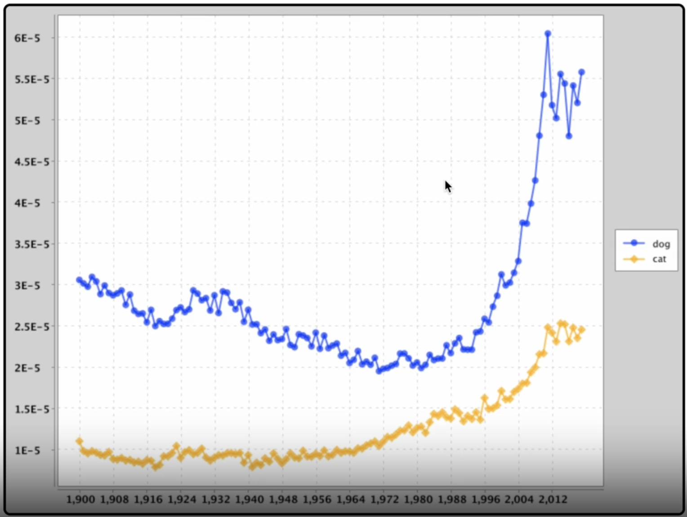

As a book nerd, I enjoyed developing a tool in Java that analyzes texts to create word maps, providing insights into word usage and frequency. 
<!--more-->

# Java Word Mapping Tool (NGramMap)

## Technologies Used
- **Programming Language:** Java
- **Testing Framework:** JUnit
- **Dataset:** Google NGram dataset
- **IDE:** IntelliJ
- **Custom Packages:** TimeSeries (extension of Tree Maps), text handlers, NGramMap

## Project Overview
As a computer science enthusiast, I have always been fascinated by the power of data visualization to help us better understand complex information. That's why I decided to work on the NGramMap project, a web-based tool that lets users explore the historical popularity of words and word lists.

## Interactive Web Interface
The core of the project is a custom data structure that allows for efficient storage and retrieval of NGram data. This structure is used to populate the visualizer, which presents the user with an interactive web interface that allows them to see how the popularity of different words has changed over time. Users can also see the hyponyms or words that are common across the map for the list of words the user enters.

## Video Demonstration
<iframe width="560" height="315" src="https://www.youtube.com/embed/MiXZLwlExEw" frameborder="0" allow="accelerometer; autoplay; clipboard-write; encrypted-media; gyroscope; picture-in-picture" allowfullscreen></iframe>

## Implementation Details
The NGramMap project was built using Java packages that were specifically designed to handle large amounts of text data. To power the visualizer, I used 30% of Google's NGram dataset, which contains a vast collection of words and phrases that have been recorded over time.

## Development Challenges and Testing
One of the key challenges in building NGramMap was ensuring that the system could handle the data being processed. To mitigate these risks, I conducted extensive JUnit testing, running over 45 tests to ensure that the functionality of the program was robust and that there were no technical risks. This process was crucial to making sure that NGramMap would be a reliable tool that users could depend on.

## Conclusion
The NGramMap project is a powerful tool that allows users to explore the historical popularity of words and word lists in a way that is both informative and engaging. By designing and implementing a custom data structure and web interface, I was able to create a tool that can handle large amounts of data and provide a seamless user experience. I look forward to continuing to explore the intersection of data and visualization in my future work.
