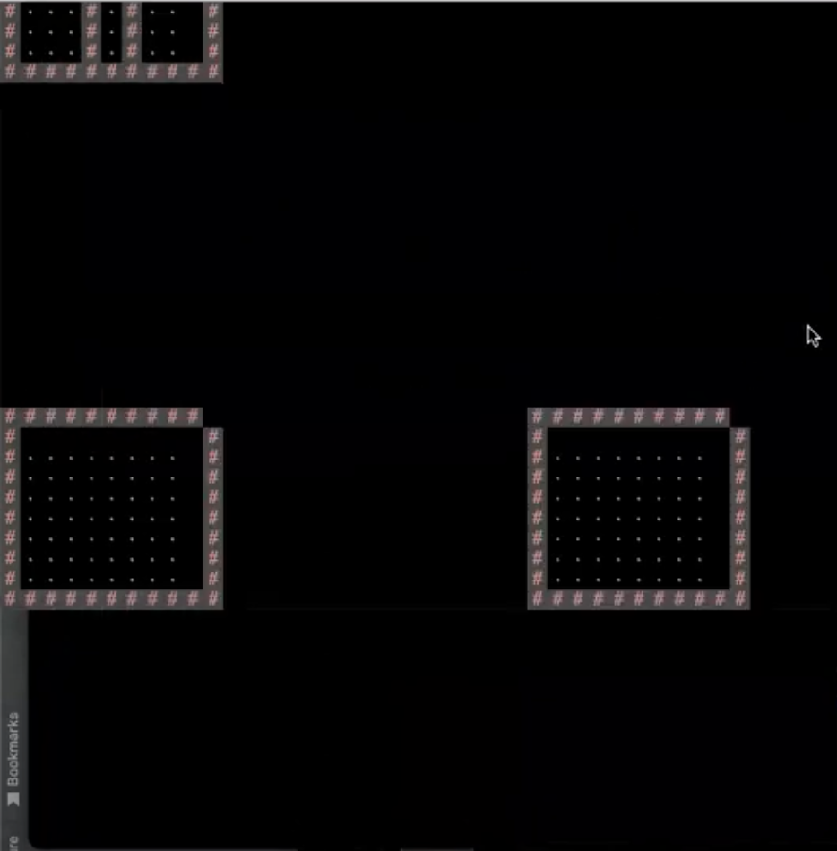
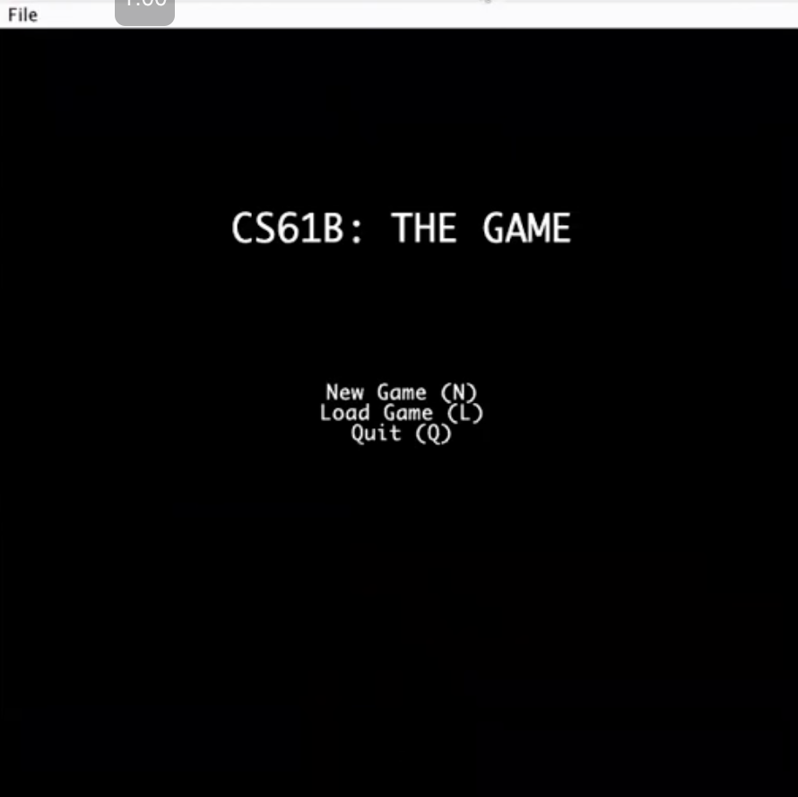

Developed a tile-based board game with a partner using Java, allowing for avatar movement controlled by keyboard input and mouse clicks. The game features a file storage system for saving and loading progress, a UI that generates a random tileboard with walls and an avatar, and software quality assurance through extensive JUnit tests.

<!--more-->

# Java World Mapping Tool: NGramMap

## Technologies Used
- **Programming Language**: Java, IntelliJ, Java Standard Draw Library
- **Testing Framework**: JUnit

## Project Overview
As part of a collaborative project, we developed a tile-based board game that allows players to control an avatar's movement using keyboard inputs and mouse clicks. The game provides an engaging experience by generating a random tileboard each time the game starts.

## Key Features
### Avatar Movement
The game supports intuitive avatar movement across a randomly generated tileboard. Players can use keyboard inputs and mouse clicks to navigate the game environment.

### File Storage System
We implemented a robust file storage system that allows users to save their game progress and load it later. This feature enhances the user experience by providing continuity across game sessions.

### UI Design
The game's user interface is designed to represent various game elements, including walls, the avatar, and the floor. The UI also displays key statistics and provides a comprehensive game menu for easy navigation.

### Software Quality Assurance
To ensure the game's reliability, we wrote over 35 JUnit tests. These tests helped us identify and fix bugs early in the development process, maintaining a high standard of software quality. Additionally, we maintained a live design document throughout the project to track our progress and design decisions.

## Screenshots from the Game

## Conclusion
This project was a valuable learning experience in game development and UI design. By collaborating with a partner, I was able to enhance my skills in Java programming, software design, and quality assurance.
