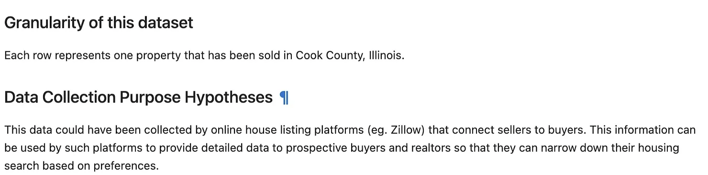
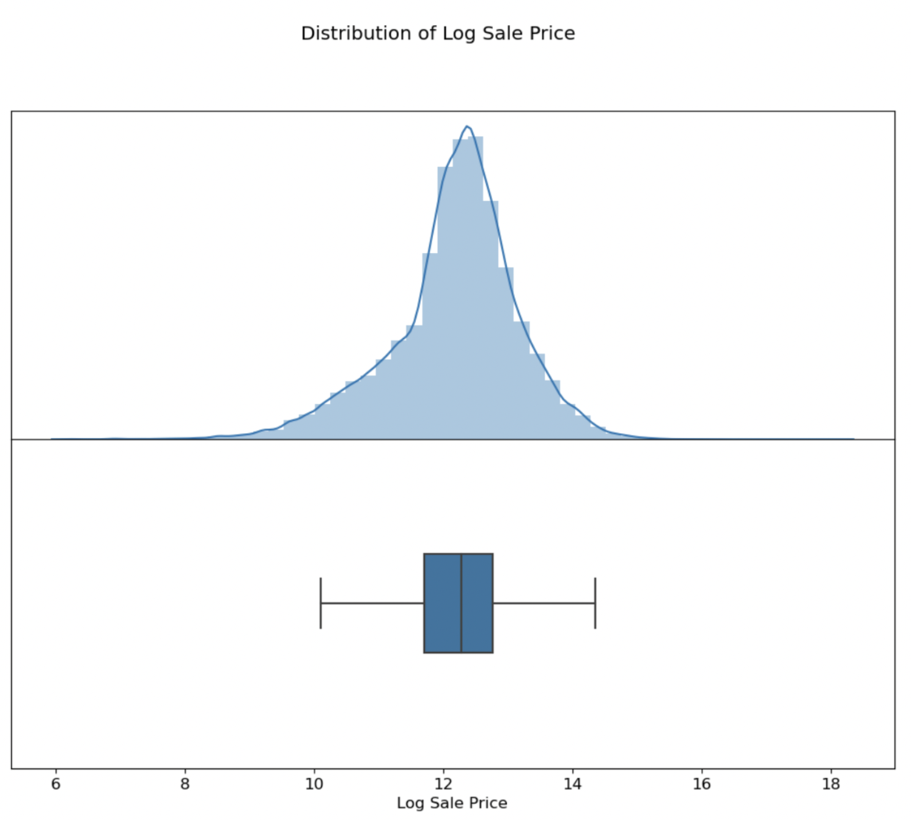
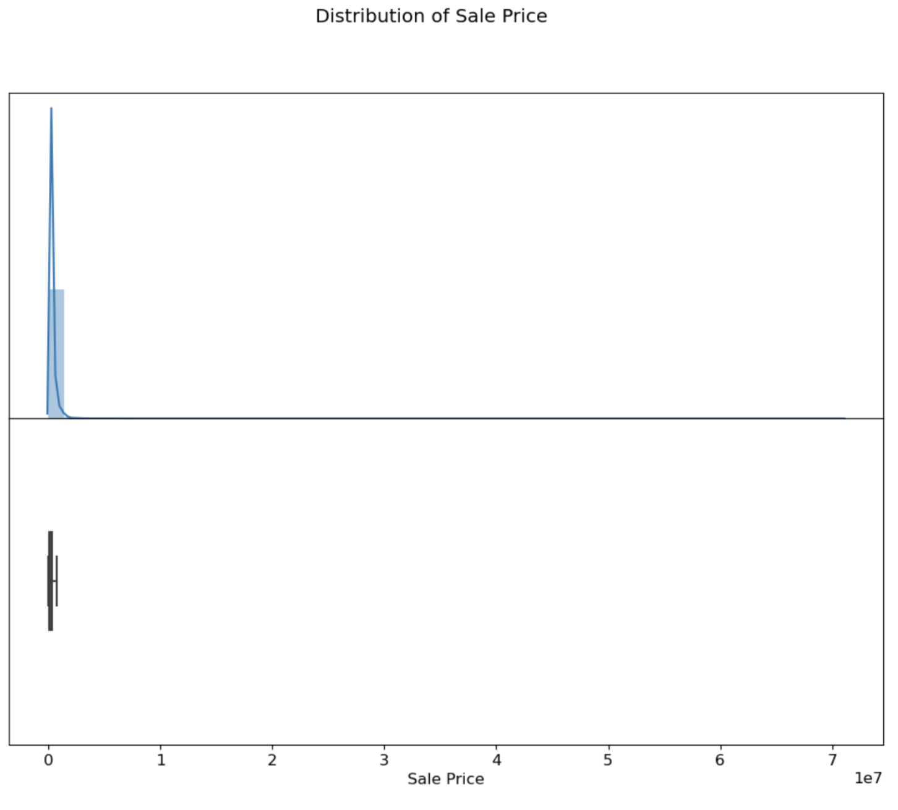
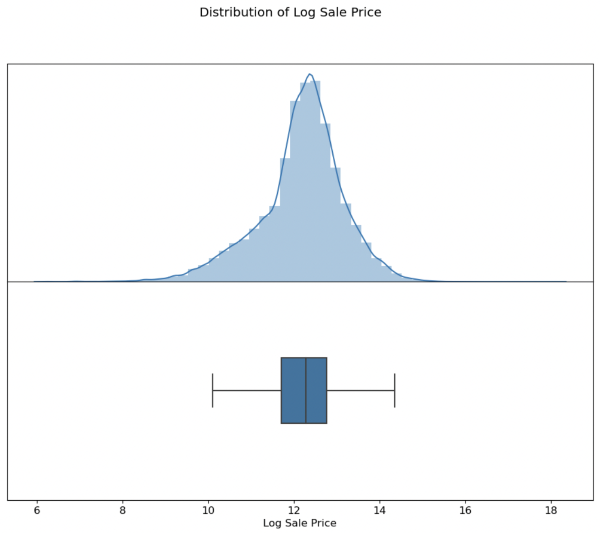
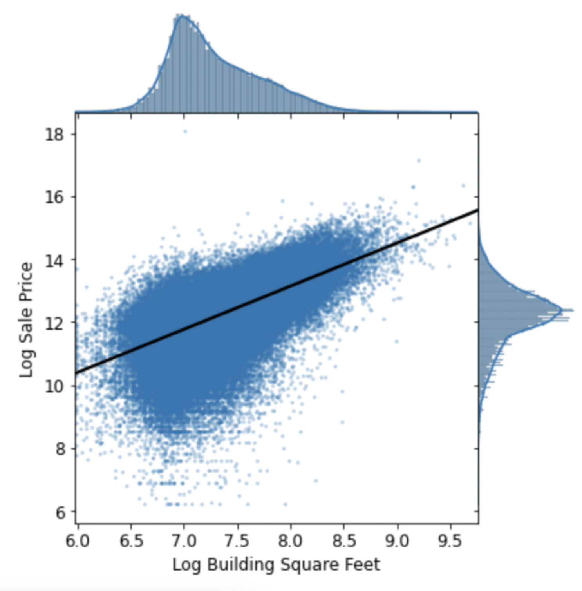
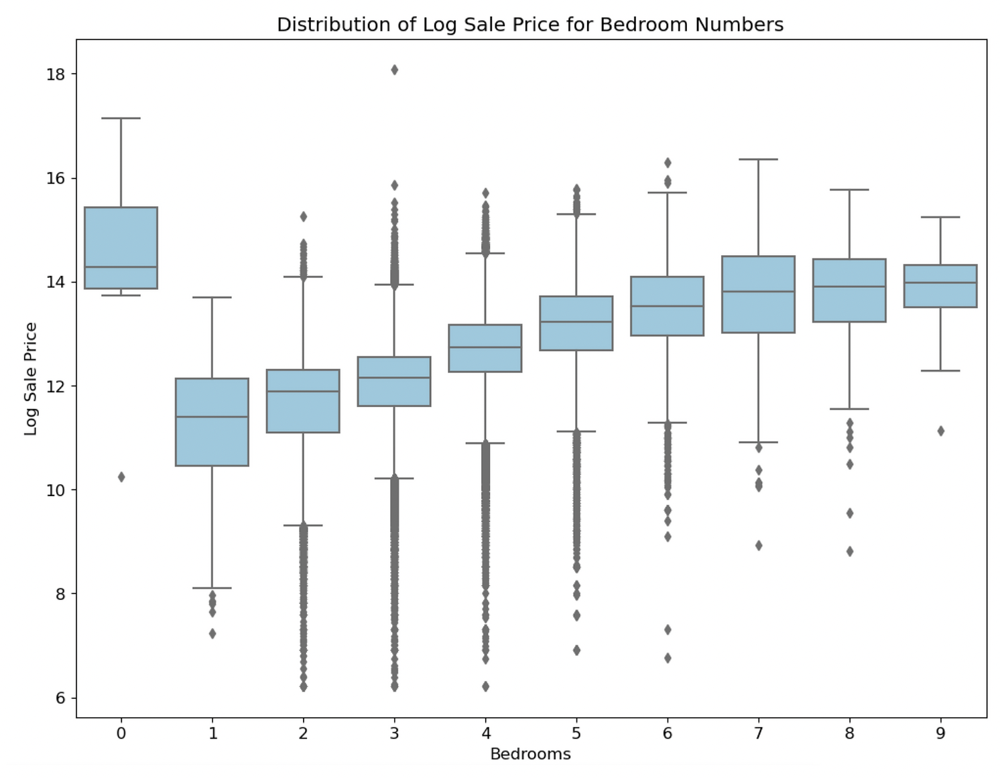
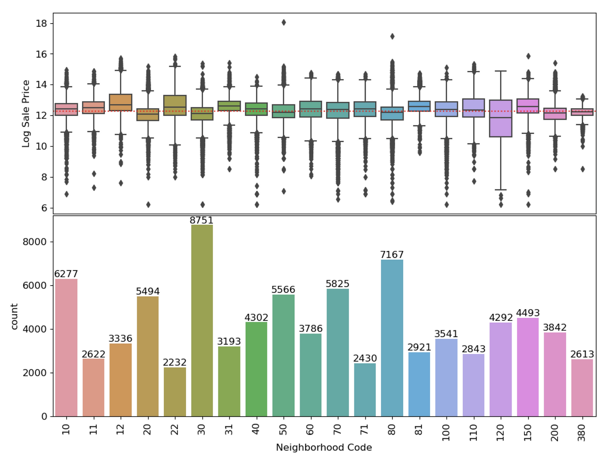
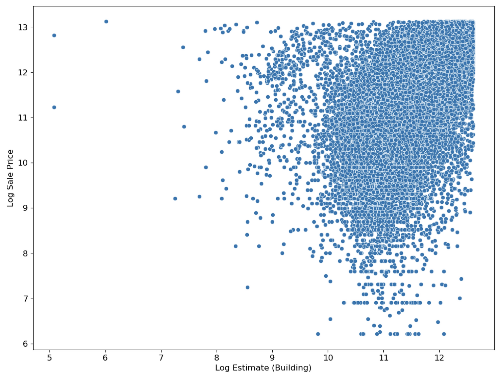
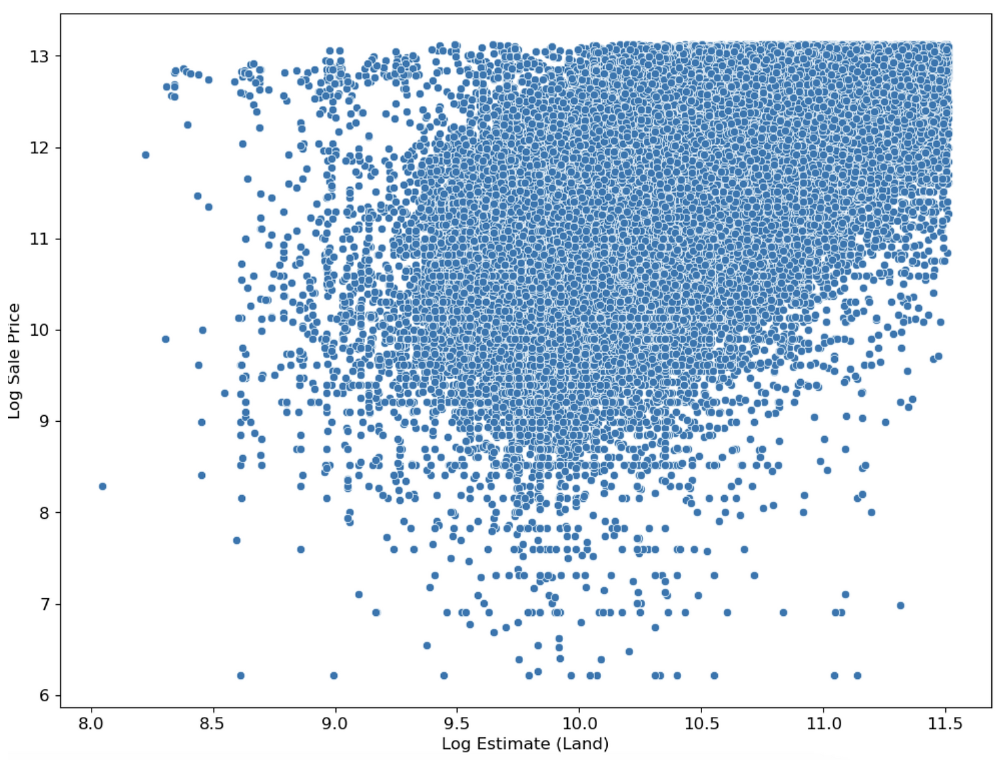
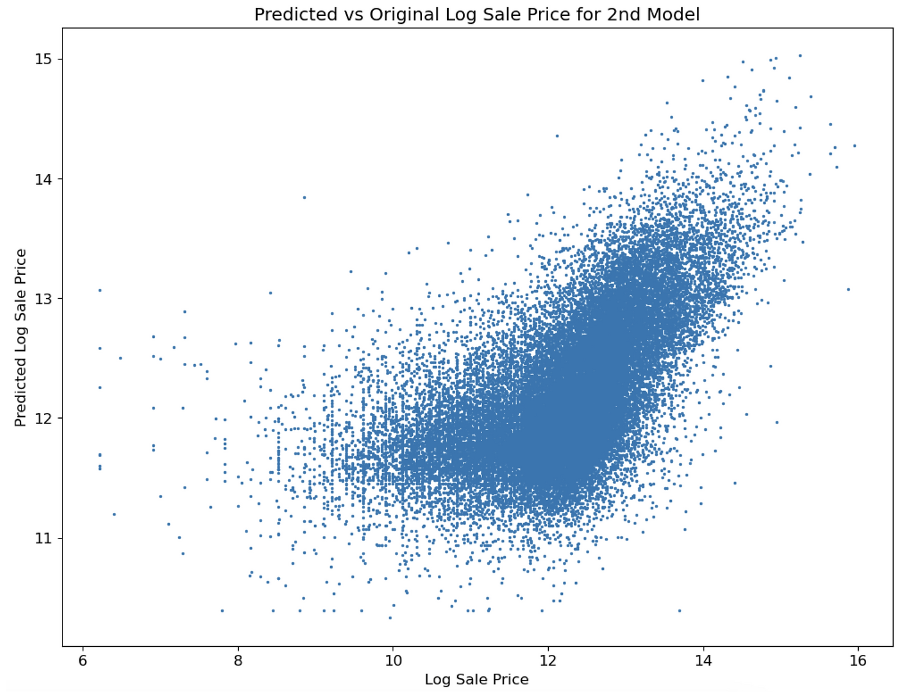

Developed a high-performing model to predict housing prices in Cook County, analyzing a dataset of over 500,000 entries to identify key features and demonstrate the impact of regressive taxation.

<!--more-->
# Analyzing Racism in Housing Price Taxation in Cook County: A Data-Driven Approach 

Technologies used: Jupyter Notebook, Regex, Seaborn library, Numpy library, matplotlib library, Cook County Assessor's Office Dataset on properties

Note: Project walkthrough, visualizations, and screenshots (below)

As a data scientist, I'm always on the lookout for ways to apply my skills to address social issues. In this project, I decided to take on the problem of racism in housing price taxation in Cook County. Using my knowledge of machine learning, statistical analysis, and data visualization, I developed a high-performing model to predict housing prices in the county and analyzed a dataset of over 500,000 entries from the Cook County Assessor's Office.

First, I conducted exploratory data analysis on the 500,000-entry Cook County Assessor Office dataset with 61 features using Seaborn. Through this process, I gained insights into the distribution and correlation of the data, which were crucial in identifying key features to use in my model.

Next, I developed a high-performing model using one-hot encoding and cross-validation techniques to predict housing prices. My model consisted of 9 features, which I selected based on their significance and correlation with the target variable through my exploratory data analysis. I continuously improved my model by performing feature engineering and fine-tuning hyperparameters to ensure optimal performance.

To evaluate the effectiveness of my model, I compared it to the official model used by Cook County to understand the regressive taxation scheme implemented. Through this comparison, I was able to identify flaws in the official model and demonstrate the superiority of my custom model.

I conducted feature selection analysis and reduced the complexity of my model, resulting in a higher accuracy measured by mean square error minimization. To further understand the data, I created 19 visualizations using Seaborn and matplotlib and extracted data for 4 model features using Regex.

In conclusion, my data-driven approach to analyzing racism in housing price taxation in Cook County provided valuable insights into the issue and demonstrated the power of machine learning and statistical analysis in addressing real-world problems. I also understood the the Data Science lifecycle better, especially the iterative aspects of the process that require constant learning.

## Screenshots of Project (Jupyter Notebook) featuring key visualizations and context

## Part 1: Contextualizing the Data

## Part 2: Exploratory Data Analysis

## Part 3: Feature Engineering & Model Selection

