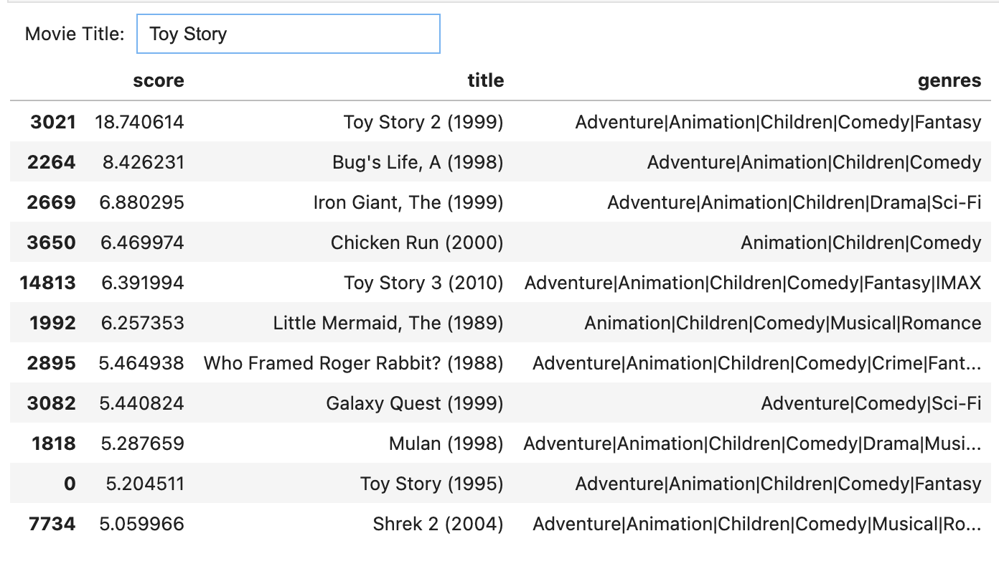
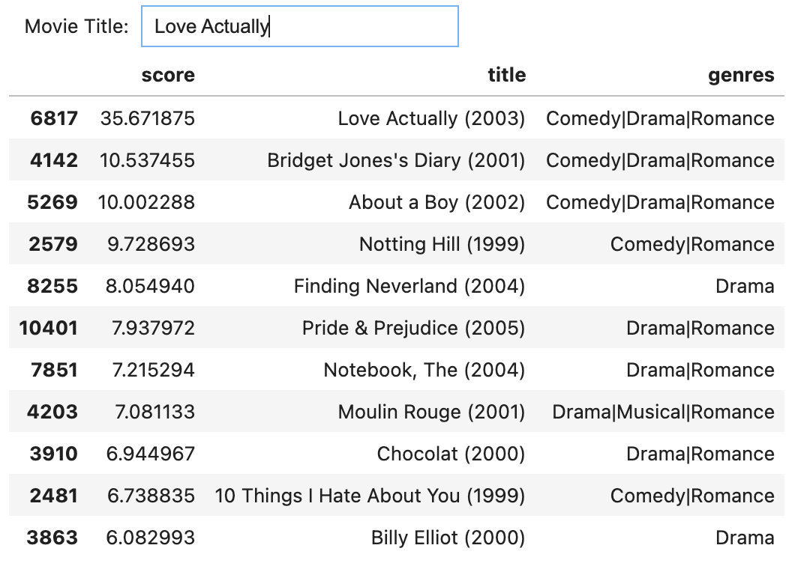
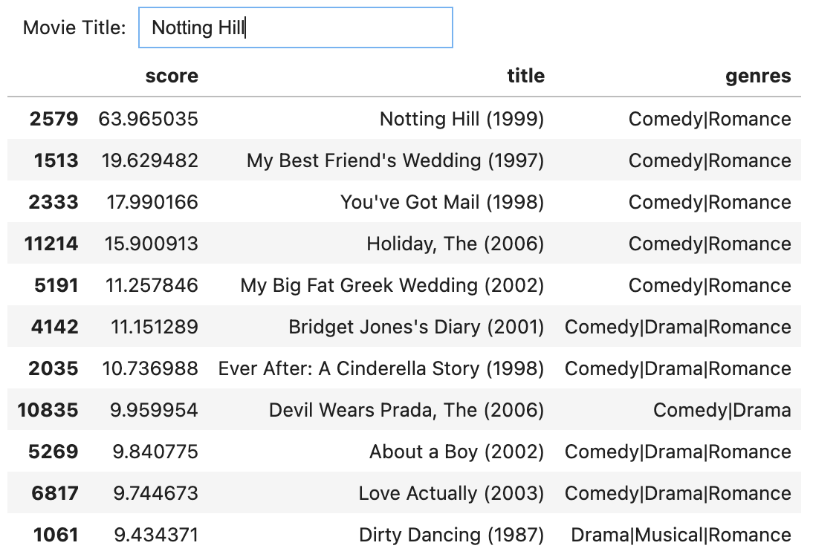

Developed a Movie Recommendation Engine using Python and data science libraries to suggest movies based on user ratings and metadata.

<!--more-->

## Project Overview

During winter break, I was sick and confined to bed, watching Netflix to pass the time. I found myself struggling to decide what to watch next, which inspired me to create a Movie Recommendation Engine. Using Python, Jupyter Notebook, and various data science libraries, the engine suggests movies similar to a user-provided movie title based on user ratings and movie metadata.

## Technologies Used

- **Programming Language:** Python
- **Libraries:** Pandas, Numpy, Scikit-learn, IPython.display, ipywidgets
- **Tools:** Jupyter Notebook

### Data Cleaning and Setup

We start by importing the necessary libraries and reading the data from CSV files containing movie metadata and user ratings.

The data is cleaned using regex to remove any unwanted characters, ensuring a clean dataset for analysis.

### Building the Search Engine

We convert the movie titles into sets of numbers using TF-IDF Vectorizer to facilitate efficient search operations.

### Creating the Search Function

Using cosine similarity, we create a search function that computes the similarity between the user's input and the movie titles in our dataset.

### Building the Interactive Widget

An interactive widget is built using IPython.display and ipywidgets to allow users to input a movie title and receive recommendations in real-time.

### Creating a Recommendation Score

The ratings dataset is read, and we find users who have watched and liked the same movie. This information is used to find other movies liked by similar users. We create a recommendation score based on how commonly liked the chosen movies are among similar users.

### Final Recommendations

The final recommendations for Toy Story, Love Actually, and Notting Hill are displayed in a sorted list based on the computed scores.

## Conclusion

This project showcases the power of data science and machine learning in building a functional movie recommendation engine. By leveraging user ratings and movie metadata, we can provide personalized movie recommendations that enhance the user experience.
