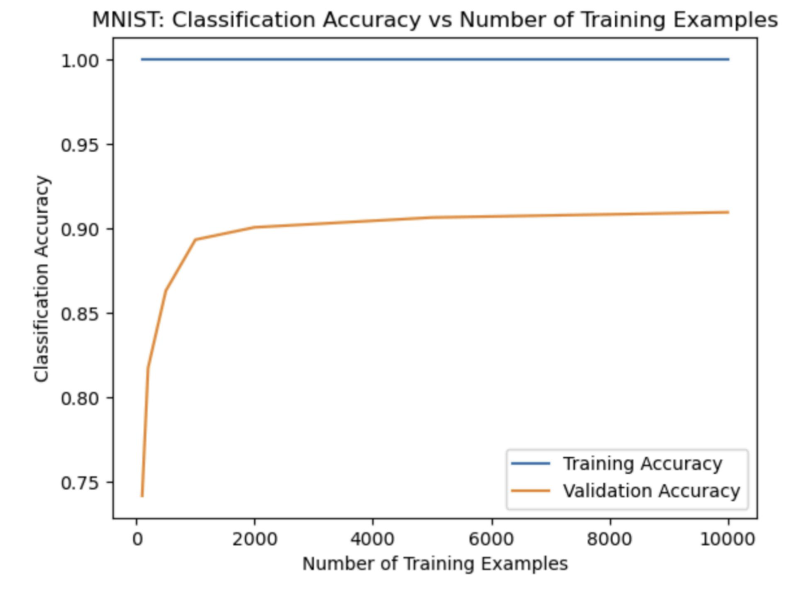

In this project, I explored various machine learning techniques to classify handwritten digits from the MNIST dataset. 

<!--more-->

## Machine Learning Exploration: 3 Approaches to Classifying Handwritten Digits

In this project, I explored various machine learning techniques to classify handwritten digits from the MNIST dataset. Below, I summarize the different methods I employed and the insights gained from each approach.

### Method 1: SVM with RBF Kernel

To begin, I implemented a Support Vector Machine (SVM) with a Radial Basis Function (RBF) kernel. Given the high performance of this model on the Spam dataset, I applied the same setup to the MNIST dataset, only adjusting the C values for hyperparameter tuning.

The results were promising. The Kaggle score achieved was 0.947. I tested a range of C values from 10.0 to 100,000.0, and found that larger C values significantly improved accuracy. The best C value identified was 10,000.0, which provided the highest performance.

### Method 2: K-Fold Cross-Validation

To ensure the robustness of my model, I used K-Fold Cross-Validation with 12 different C values. This method allowed me to identify the optimal C value that generalizes well on unseen data.

Through this approach, I tested C values ranging from 0.6 to 20.0. The best C value found was 10.5716, resulting in an accuracy of 0.8055. K-Fold Cross-Validation confirmed the effectiveness of the selected C value, providing a reliable metric for model performance.

### Method 3: Hyperparameter Tuning

In this approach, I experimented with a geometric series of C values to fine-tune the SVM model. This step was crucial to finding the most effective hyperparameter settings.

I tested C values from 1e-08 to 1.0. The tuning process demonstrated that smaller C values performed exceptionally well, with the best C value being 1e-06, which achieved an accuracy of 0.9293.

### Testing and Conclusion

To validate the effectiveness of these approaches, I conducted extensive testing across different configurations and datasets. The rigorous testing process ensured the robustness and reliability of the models.

The testing results showed that all methods maintained high correctness rates. By implementing and testing these methods, I identified the most effective techniques for various aspects of the classification task, culminating in a robust and efficient model. This project demonstrates the value of combining different approaches to achieve optimal performance in machine learning applications.
