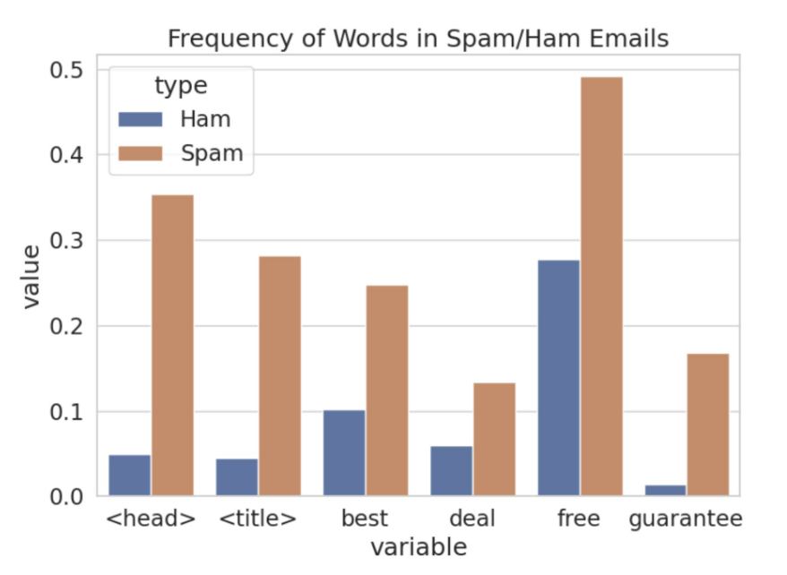
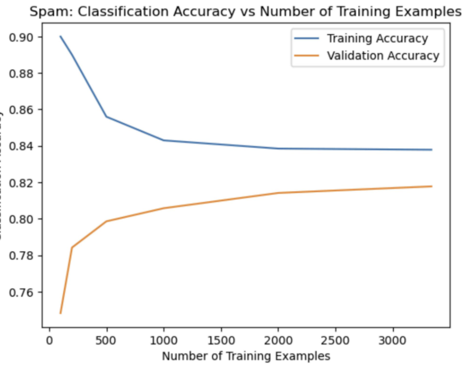
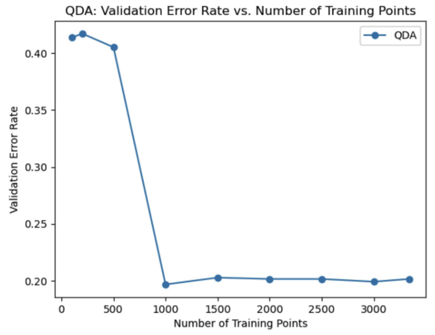
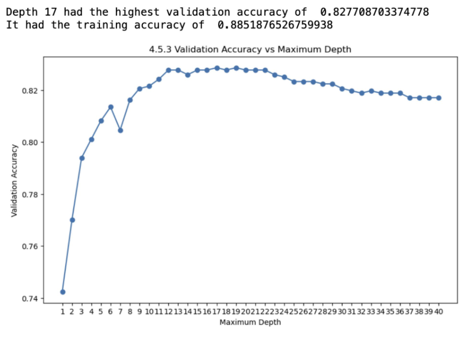

I explored six different machine learning techniques for classifying spam and ham emails in this project. 

<!--more-->

# Spam Emails Classification: 6 Approaches to Machine Learning

### Logistic Regression
Logistic regression is a simple and widely used classification technique. It models the probability that a given input belongs to a particular class. For the spam classification task, I implemented a logistic regression classifier and achieved a prediction accuracy of 75.76%. This was slightly better than the baseline accuracy of predicting 0 for every email, which yielded 74.47% accuracy. Although logistic regression provided a reasonable starting point, it was clear that more sophisticated models were needed to achieve higher accuracy.

### SVMs Using 5-Fold Cross-Validation with a Linear Kernel Model
Support Vector Machines (SVMs) are powerful classifiers that work well with high-dimensional data. I initially used a linear kernel model with 5-fold cross-validation. I observed that using smaller C values and a linear kernel did not yield satisfactory results. To improve performance, I switched to using the radial basis function (rbf) kernel and a larger range of C values. This change significantly improved the accuracy and pushed the model over the Kaggle threshold. The best model achieved a high classification accuracy, making SVMs with cross-validation a robust choice for this task.

### LDA (Linear Discriminant Analysis)
Linear Discriminant Analysis (LDA) is a statistical method used to find a linear combination of features that characterizes or separates two or more classes. For the spam classification task, LDA was initially applied, and although it provided reasonable performance, the accuracy values did not meet expectations. The validation error rate for LDA was 0.21013117569595206. By integrating additional features based on observed keywords, email length, and presence of links, the performance of the LDA model improved. Despite these enhancements, LDA did not outperform more advanced techniques like QDA.

### QDA (Quadratic Discriminant Analysis)
Quadratic Discriminant Analysis (QDA) extends LDA by modeling each class with its own covariance matrix, allowing for more flexible decision boundaries. I observed an improvement in accuracy over LDA when using QDA. By engineering over 20 additional features and integrating them into the QDA model, I achieved a significant increase in classification accuracy. The validation error rate for QDA was 0.20148384892086328, making it a superior choice compared to LDA. QDA's ability to capture more complex relationships in the data contributed to its better performance.

### Decision Tree
Decision trees are intuitive models that split the data into subsets based on feature values, forming a tree-like structure. For the spam classification task, I experimented with various depths for the decision tree model. Depth 17 yielded the highest validation accuracy of 0.8277, with a training accuracy of 0.8852. Although decision trees provided good performance, they are prone to overfitting, which was evident from the difference between training and validation accuracies.

### Random Forest
Random forests are ensembles of decision trees that improve classification performance by averaging the predictions of multiple trees, reducing overfitting. For the spam classification task, random forests showed promising results. The training accuracy was 0.7759, and the validation accuracy was 0.7798. Random forests benefited from their ability to generalize better than single decision trees, leading to more stable and reliable performance across different subsets of the data.

## Summary
Each of the six techniques provided unique insights and varying levels of performance for the spam classification task. Logistic regression offered a straightforward baseline, while SVMs with a linear kernel and cross-validation showed the importance of kernel choice and hyperparameter tuning. LDA and QDA demonstrated the impact of feature engineering and the benefits of more flexible models. Decision trees and random forests highlighted the trade-off between model complexity and generalization. By exploring these diverse approaches, I was able to improve classification accuracy and understand the strengths and limitations of each technique.

